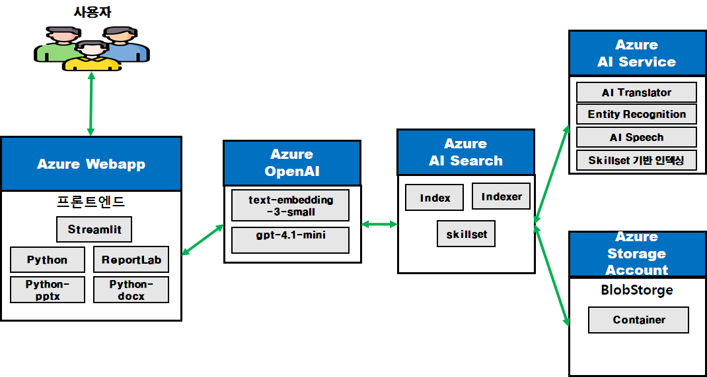

# MVP_Project - by AI구독서비스팀 김형국
- **MVP 과제명** : 신규 사업 추천 및 보고서 작성 도우미
- **작성자**     : AI구독서비스팀 김형국
- **Azure Resource 그룹** : pro-khk-rg 

 # 신규 사업 추천 및 보고서 작성 도우미 - 기능명세서

## 1. 시스템 개요

### 1.1 목적
사용자가 입력한 키워드를 기반으로 RAG(Retrieval-Augmented Generation) 검색을 수행하고, AI를 활용하여 유망 산업군을 추천하며, 선택된 산업에 대한 종합 시장 분석 보고서를 자동 생성하는 시스템

fd
### 1.2 주요 기술 스택
- **프론트엔드**: 
   - Streamlit 기반 Web UI 개발
   - 문서 생성 : ReportLab (PDF), python-docx (Word), python-pptx (PowerPoint)
- **WEBAPP**: Azure WebApp
   - 자원 이름 : pro-khk-webapp-v01
   - WEB 배포 자원
   - VS Code 기반 배포 및 startup.sh 구성 
- **검색 엔진**: Azure AI Search
  - 자원 이름 : pro-khk-search-v01
  - RAG 검색 용도 
  - 인덱스 생성 시 번역 기술, 엔터티 인식 기술(V3) skillset을 추가 
- **스토리지 계정**: Azure Storage Account
  - 자원 이름 : khkstorageacc 
  - RAG를 위한 스토리지 계정, 
  - "weekyreports" 컨테이너에 정보통신기획 평가원의 "주간기술동향" 문서 및 시장 동향 자료 구축 (총 23개 문서)
- **AI 모델**: Azure OpenAI (GPT)
  - 자원 이름 : pro-khk-openai-v01
  - 배포 모델 : text-embedding-3-small, gpt-4.1-mini
  **AI 서비스** : Azure AI Service 
  - 자원 이름 : pro-khk-aiservice-v01
  - 번역 기술, 엔터티 인식 기술(V3) skillset 지원 용도 

### 1.3 기능 구성도



---

## 2. 핵심 기능

### 2.1 키워드 기반 RAG 검색
**기능 코드**: F-001

**설명**: 사용자가 입력한 키워드로 Azure AI Search에서 관련 문서를 검색 (RAG)

**입력**
- 키워드 (텍스트)

**처리**
- Azure Search Index(rag-new-test)에서 상위 5개 문서 검색
- 검색 결과에서 제목 및 본문 추출

**출력**
- 검색된 문서 목록 (제목, 본문 미리보기)
- 문서별 확장 가능한 상세 내용

**예외 처리**
- 검색 결과 없음: 경고 메시지 표시
- API 오류: 에러 메시지 및 재시도 안내

---

### 2.2 AI 기반 산업군 추천
**기능 코드**: F-002

**설명**: 검색된 문서를 분석하여 관련 유망 산업군 5개 추천

**입력**
- RAG 검색 결과 (문서 목록)
- 사용자 키워드

**처리**
- 검색된 문서 내용을 GPT에 전달
- 산업 분석 전문가 페르소나로 산업군 추천
- 각 산업군에 대한 간단한 설명 생성

**출력**
- 추천 산업군 목록 (5개)
- 각 산업군별 1-2문장 설명
- 선택 가능한 드롭다운 메뉴

**제약사항**
- 최대 5개 산업군 추천
- 각 설명은 1-2문장으로 제한

---

### 2.3 대화형 산업 분석 (Q&A)
**기능 코드**: F-003

**설명**: 선택된 산업군에 대해 GPT와 대화형 질의응답 수행

**입력**
- 사용자 질문 (자유 텍스트)
- 선택된 산업군
- 이전 대화 내역 (컨텍스트)

**처리**
- 대화 이력을 포함한 컨텍스트 유지
- GPT를 통한 답변 생성
- 대화 내역 세션 저장

**출력**
- AI 답변
- 대화 기록 목록 (최신순)
- 각 대화별 확장 가능한 뷰

**부가 기능**
- 이전 대화 기록 유지 옵션
- 대화 기록 초기화

---

### 2.4 단계별 보고서 작성
**기능 코드**: F-004

**설명**: 8개 섹션으로 구성된 종합 시장 분석 보고서를 순차적으로 작성

**보고서 구성**
1. 산업 개요 및 시장 동향
2. 시장 규모 및 성장 전망
3. 주요 경쟁사 분석
4. 핵심 기술 및 혁신 동향
5. 타겟 고객 및 시장 세그먼트
6. 사업 기회 및 진입 전략
7. 리스크 요인 및 대응 방안
8. 결론 및 향후 전망

**입력**
- 선택된 산업군
- 대화 이력 (컨텍스트)
- 이전 작성 섹션 (연속성 유지)

**처리**
- 섹션별 순차 작성 (1→2→...→8)
- 이전 섹션 내용을 참조하여 일관성 유지
- GPT를 통한 전문적인 보고서 내용 생성

**출력**
- 각 섹션별 마크다운 형식 텍스트
- 진행률 표시 (N/8 섹션)
- 섹션별 미리보기

**부가 기능**
- 실시간 진행 상황 표시
- 작성 중인 보고서 전체 미리보기

---

### 2.5 보고서 수정 기능
**기능 코드**: F-005

**설명**: 작성된 보고서 섹션을 선택적으로 수정 또는 재작성

**입력**
- 수정할 섹션 선택
- 수정 요청사항 (텍스트)

**처리**
- **수정 모드**: 사용자 요청사항 반영하여 부분 수정
- **재작성 모드**: 섹션 전체를 새롭게 작성

**출력**
- 수정/재작성된 섹션 내용
- 업데이트된 보고서 전체 미리보기

**제약사항**
- 이전/이후 섹션과의 연결성 유지
- 스타일 및 톤 일관성 유지

---

### 2.6 다중 형식 파일 생성
**기능 코드**: F-006

**설명**: 완성된 보고서를 PDF, Word, PowerPoint 형식으로 다운로드

**지원 형식**
1. **PDF**: ReportLab 라이브러리 사용
   - 한글 폰트 지원 (NanumGothic)
   - 커스텀 스타일 적용
   - A4 페이지 레이아웃

2. **Word (DOCX)**: python-docx 라이브러리 사용
   - 제목, 본문 스타일 구분
   - 한글 폰트 (맑은고딕)
   - 편집 가능한 형식

3. **PowerPoint (PPTX)**: python-pptx 라이브러리 사용
   - 섹션별 슬라이드 생성
   - 타이틀 슬라이드 포함
   - 자동 콘텐츠 분할 (슬라이드당 최대 7개 항목)

**입력**
- 파일 형식 선택
- 완성된 보고서 내용

**처리**
- 선택된 형식으로 파일 생성
- 한글 폰트 로드 및 적용
- 마크다운 → 문서 형식 변환

**출력**
- 다운로드 가능한 파일 (바이너리)
- 파일명: `보고서_{산업군}_{키워드}.{확장자}`

**예외 처리**
- 폰트 로드 실패: 기본 폰트로 대체
- 생성 실패: 에러 메시지 및 대체 형식 제안

---

### 2.7 세션 관리
**기능 코드**: F-007

**설명**: 작업 진행 상태 및 데이터 관리

**기능**
- **전체 초기화**: 모든 세션 데이터 삭제 및 재시작
- **상태 유지**: 페이지 새로고침 시 데이터 보존 (Streamlit Session State)
- **진행 상황 추적**: 사이드바에 실시간 진행 상태 표시

**저장 데이터**
- 입력 키워드
- 검색 결과
- 추천 산업군 목록
- 선택된 산업군
- 대화 이력
- 보고서 섹션별 내용
- 현재 작성 섹션 인덱스
- 보고서 완료 여부
- 생성된 파일 정보

---

### 2.8 사이드바 정보 표시
**기능 코드**: F-008

**설명**: 사이드바에 진행 상황 및 통계 정보 표시

**표시 정보**
- **보고서 작성 진행**
  - 진행률 바
  - 완료 섹션 수 (N/8)
  - 완료된 섹션 목록 (체크 표시)

- **전체 초기화 버튼**
  - 모든 작업 리셋

**실시간 업데이트**
- 섹션 작성 시 즉시 반영
- 진행률 자동 계산

---

## 3. 화면 흐름

### 3.1 메인 워크플로우
```
1. 키워드 입력
   ↓
2. RAG 검색 수행 및 결과 표시
   ↓
3. GPT 산업군 추천 (5개)
   ↓
4. 산업군 선택
   ↓
5. Q&A 대화형 분석
   ↓
6. 보고서 작성 시작
   ↓
7. 섹션별 순차 작성 (1~8)
   ↓
8. 보고서 수정 (선택)
   ↓
9. 최종 완료
   ↓
10. 파일 생성 및 다운로드
```

### 3.2 보고서 작성 세부 흐름
```
섹션 1 작성
   ↓
미리보기 및 확인
   ↓
섹션 2 작성
   ↓
...
   ↓
섹션 8 작성
   ↓
전체 미리보기
   ↓
[선택] 특정 섹션 수정
   ↓
최종 완료
```

---

## 4. 기술 요구사항

### 4.1 환경 변수
```
AZURE_SEARCH_ENDPOINT     # Azure Search 엔드포인트
AZURE_SEARCH_KEY          # Azure Search API 키
AZURE_SEARCH_INDEX        # 검색 인덱스 이름
AZURE_OPENAI_KEY          # Azure OpenAI API 키
AZURE_OPENAI_DEPLOYMENT   # OpenAI 배포 모델명
AZURE_OPENAI_ENDPOINT     # OpenAI 엔드포인트
```

### 4.2 외부 라이브러리
- streamlit
- azure-search-documents
- azure-core
- openai
- python-dotenv
- reportlab
- python-docx
- python-pptx

### 4.3 폰트 파일 (PDF 생성용, 한글깨짐 방지)
- NanumGothic-Regular.ttf
- NanumGothic-Bold.ttf
- NanumGothic-ExtraBold.ttf

---

## 5. 비기능 요구사항

### 5.1 성능
- 검색 응답 시간: 3초 이내
- GPT 응답 시간: 10초 이내
- 파일 생성 시간: 5초 이내

### 5.2 사용성
- 직관적인 단계별 진행 UI
- 실시간 진행 상황 표시
- 명확한 에러 메시지

### 5.3 안정성
- API 호출 실패 시 재시도 로직
- 세션 데이터 손실 방지
- 예외 상황 적절한 처리

### 5.4 확장성
- 새로운 보고서 섹션 추가 용이
- 추가 파일 형식 지원 가능
- 다양한 AI 모델 지원 가능

---

## 6. 제약사항 및 한계

### 6.1 시스템 제약
- Azure OpenAI API 사용량 제한
- GPT 토큰 제한 (최대 2000 토큰/응답)
- 검색 결과 최대 5개 문서

### 6.2 기능 제약
- 한 번에 하나의 산업군만 분석 가능
- 보고서 섹션 순서는 고정
- 이미지, 차트 등 시각 자료 미지원

### 6.3 기술 제약
- 한글 폰트가 없을 경우 PDF 한글 표시 제한
- 대용량 보고서 생성 시 메모리 사용량 증가
- 인터넷 연결 필수 (Azure API)

---

## 7. 향후 개선 방향

### 7.1 단기 (1-3개월)
- 진행 상태 저장/불러오기 기능
- 보고서 템플릿 선택 기능
- 차트 및 그래프 자동 생성

### 7.2 중기 (3-6개월)
- 다중 산업군 동시 비교 분석
- 사용자 정의 보고서 섹션
- 협업 기능 (공유, 댓글)

### 7.3 장기 (6-12개월)
- 실시간 시장 데이터 연동
- AI 기반 경쟁사 모니터링
- 자동 업데이트 및 알림 기능